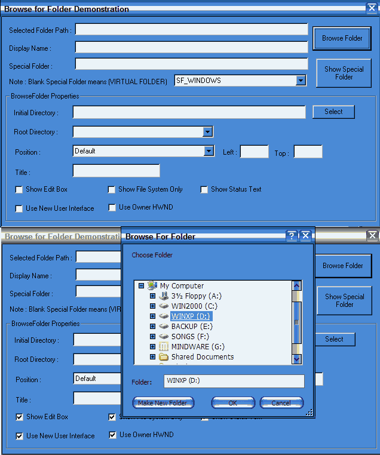



## BrowseFolder Dialog

### Description

This component gives you more functionality to select folders. Some of them are dialog-box position (center to parent form, center to screen or custom position also), select root directory, select initial directory as well as gives the special folder location like your systems windows directory, your system directory, your application dir etc.
 
### More Info
 

             |
---                |---
**Submitted On**   |2005-12-24 22:53:46
**By**             |[voidData](https://github.com/Planet-Source-Code/PSCIndex/blob/master/ByAuthor/voiddata.md)
**Level**          |Advanced
**User Rating**    |5.0 (10 globes from 2 users)
**Compatibility**  |VB 5\.0, VB 6\.0, VB Script
**Category**       |[Custom Controls/ Forms/  Menus](https://github.com/Planet-Source-Code/PSCIndex/blob/master/ByCategory/custom-controls-forms-menus__1-4.md)
**World**          |[Visual Basic](https://github.com/Planet-Source-Code/PSCIndex/blob/master/ByWorld/visual-basic.md)
**Archive File**   |[BrowseFold19601412272005\.zip](https://github.com/Planet-Source-Code/voiddata-browsefolder-dialog__1-63819/archive/master.zip)

